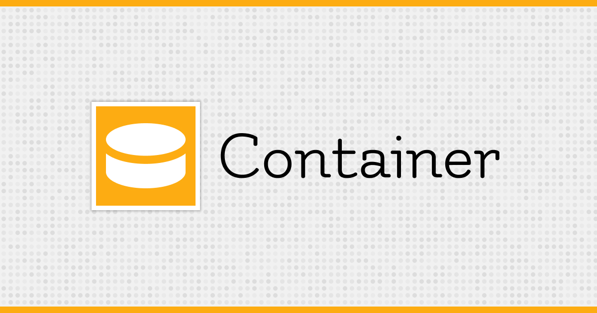

# Container

[![Latest Version on Packagist][ico-version]][link-packagist]
[![Software License][ico-license]](LICENSE.md)
[![Total Downloads][ico-downloads]][link-downloads]
[![Coverage Status][ico-scrutinizer]][link-scrutinizer]
[![Quality Score][ico-code-quality]][link-code-quality]
[![Type coverage][ico-type-coverage]][link-type-coverage]
[![PHP Unit][ico-action]][link-action]
[![Say Thanks][ico-say-thank]][link-say-thank]

Container implementation which follow PSR-11.

## Requirements  

|  PHP   |   VERSION   |
| ------ | ----------- |
| 8.0 <  |  <= 1.6     |
| >= 8.0 |  >= 1.7     |

## Installation

```bash
composer require gravatalonga/container
```

## Usage

### Basic Usage  

```php
use Gravatalonga\Container\Container;

$container = new Container();
$container->set('random', function() {
    return rand(0, 1000);
});

$container->share('random1', function() {
    return rand(0, 1000);
});

// create alias 'my-rand'  
$container->alias('random1', 'my-rand');

echo $container->get('random'); // get random number each time you call this.

if ($container->has('random1'))  {
    echo $container->get('random1'); // get same random number.  
}
```

When creating a new instance of Container, you can pass on first argument configurations or entries to be already binded into container.  

```php
use Gravatalonga\Container\Container;

new Container([
    'settings' => ['my-settings'], 
    FooBar::class => function (\Psr\Container\ContainerInterface $c) { 
        return new FooBar();
    }
]);
```

### Using Service Provider  

```php
use Gravatalonga\Container\Container;


$container = new Container();
$container->set(RedisClass::class, function () {
    return new RedisClass();
});

// then you can use...
$cache = $container->get('Cache');
```

When using `set`, `factory` or `share` with Closure and if you want to get `Container` it's self, you can pass type hint of `ContainerInterface` as argument.  

```php
use Gravatalonga\Container\Container;
use Psr\Container\ContainerInterface;

$container = new Container([
    'server' => 'localhost',
    'username' => 'root'
]);

$container->set('Cache', function (ContainerInterface $container) {
    // some where you have binding this RedisClass into container... 
    return $container->make(RedisClass::class, [
        'server' => $container->get('server'), 
        'username' => $container->get('username')
    ]);
});

// set is a method alias of factory
$container->factory('CacheManager', function() {
    return new CacheManager();
});

// then you can use...
$cache = $container->get('Cache');
```

### Using Array like access  

```php
use Gravatalonga\Container\Container;

$container = new Container();  
$container[FooBar::class] = function(ContainerInterface $container) {
    return new FooBar($container->get('settings'));
};

if (isset($container[FooBar::class])) {
    echo $container[FooBar::class]->helloWorld();
}
```  

### Alias  

Alias like the name show, it to make a possibility to make an alias from one entry to another. It will throw an exception.   

```php
use Gravatalonga\Container\Container;

$container = new Container();  
$container->set(FooBar::class, function(ContainerInterface $container) {
    return new FooBar($container->get('settings'));
});

$container->alias(FooBar::class, 'foo.bar');

$foobar = $container->get('foo.bar');
```

### Callable as alternative  

```php  
use Gravatalonga\Container\Container;

$class = new class {
    public function get(): int
    {
        return mt_rand(0, 100);
    }
};

$container = new Container();  
$container->factory('random', [$class, 'get']);

$foobar = $container->get('random'); // it will get random int
```


### Extend 

```php
use Gravatalonga\Container\Container;

class Test
{
    /**
     * @var string
     */
    public $name;

    public function __construct($name = 'Jonathan Fontes')
    {
        $this->name = $name;
    }
}

$container = new Container(); 

$container->get(Test::class, function(ContainerInterface $container) {
    return new Test;
});

$container->extend(Test::class, function(ContainerInterface $container, $test) {
    return new Test($test->name.' - The greatest!');
});

echo $container->get(Test::class); // It will print 'Jonathan Fontes - The greatest!';  
```


### Advance usage  

You can resolve class which not set into container. Our container it will attempt resolve from built-in/type hint arguments of constructions.  

> **Information**: built-in is type which is built in on PHP, which is `string`, `int`, `boolean`, etc. Type Hint is type which is created by user land, such as, when creating a class you are creating a new type.  

### Using Type Hint Class  

```php
use Gravatalonga\Container\Container;

class FooBar {}

class Test
{
    public function __construct(FooBar $foobar)
    {
        $this->foobar = $foobar;
    }
}

$container = new Container(); 
$container->set(FooBar::class, function () {
    return new FooBar();
});

$container->get(Test::class); // FooBar it will inject into Test class.  
```

**Note:** We only support resolving auto wiring argument on construction if they is binded into container. Otherwise it will throw an exception if can't find entry into container.

### Using Built in type  

```php
use Gravatalonga\Container\Container;
class Test
{
    public function __construct(string $name)
    {
        $this->name = $name;
    }
}

$container = new Container(); 
$container->set('name', 'my-var');

$container->get(Test::class); // my-var it will inject into Test class.  
```  

If argument accept nullable it will attempt resolve; otherwise it will inject null as argument.  

```php
use Gravatalonga\Container\Container;

class Test
{
    /**
     * @var string
     */
    private $name;

    public function __construct(string $name = null)
    {
        $this->name = $name;
    }
}

$container = new Container(); 

$container->get(Test::class); // null it will inject into Test class.  
```  

In also attempt to resolve auto wiring of construction by its default value, it will check default value of `__construct` and it will pass that default value.   

First case, if value is a simple built-in type value.  
```php
use Gravatalonga\Container\Container;

class Test
{
    /**
     * @var string
     */
    private $name;

    public function __construct($name = 'Jonathan Fontes')
    {
        $this->name = $name;
    }
}

$container = new Container(); 

$container->get(Test::class); // 'Jonathan Fontes' it will pass into container...
```  

### Tip  

It's well-known that using singleton pattern, it's an anti-pattern.
But small feature can't hurt you  

So, you can use:  
```

$container = new Container();

// ... 

Container::setInstance($container);

```

Then you can get instance of container,  

```
$container = Container::getInstance();
```

Tips: The container can detected circular dependencies.  

## Change log

Please see [CHANGELOG](CHANGELOG.md) for more information on what has changed recently.

## Testing

```bash
composer grumphp
```

## Contributing

Please see [CONTRIBUTING](.github/CONTRIBUTING.md) and [CODE_OF_CONDUCT](.github/CODE_OF_CONDUCT.md) for details.

## Security

If you discover any security related issues, please email jonathan.alexey16[at]gmail.com instead of using the issue tracker.

## Credits

- [Jonathan Fontes][link-author]
- [Contributors][link-contributors]

## License

The MIT License (MIT). Please see [License File](LICENSE) for more information.

[ico-version]: https://img.shields.io/packagist/v/gravatalonga/container.svg?style=flat-square
[ico-license]: https://img.shields.io/badge/license-MIT-brightgreen.svg?style=flat-square
[ico-downloads]: https://img.shields.io/packagist/dt/gravatalonga/container.svg?style=flat-square
[ico-action]: https://github.com/gravataLonga/container/workflows/Continuous%20Integration/badge.svg?branch=master
[ico-scrutinizer]: https://img.shields.io/scrutinizer/coverage/g/gravatalonga/container.svg?style=flat-square
[ico-code-quality]: https://img.shields.io/scrutinizer/g/gravatalonga/container.svg?style=flat-square
[ico-type-coverage]: https://shepherd.dev/github/gravataLonga/container/coverage.svg
[ico-say-thank]: https://img.shields.io/badge/Say%20Thanks-!-1EAEDB.svg  


[link-packagist]: https://packagist.org/packages/gravatalonga/container
[link-downloads]: https://packagist.org/packages/gravatalonga/container
[link-author]: https://github.com/gravatalonga
[link-scrutinizer]: https://scrutinizer-ci.com/g/gravatalonga/container/code-structure
[link-code-quality]: https://scrutinizer-ci.com/g/gravatalonga/container
[link-type-coverage]: https://shepherd.dev/github/gravataLonga/container
[link-contributors]: https://github.com/gravataLonga/container/graphs/contributors
[link-action]: https://github.com/gravataLonga/container/actions?query=workflow%3A%22PHP+Composer%22
[link-say-thank]: https://saythanks.io/to/jonathan.alexey16@gmail.com  
